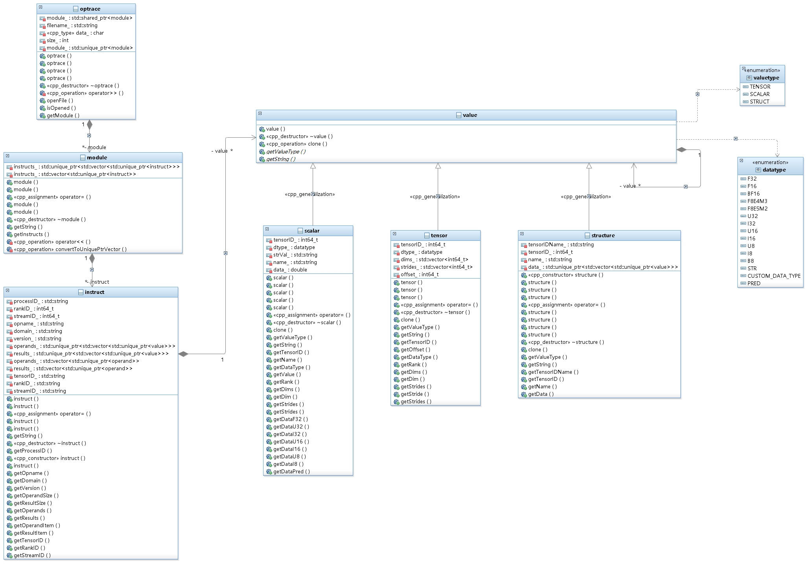

# optrace

## Build
1. pybind11 v2.13
2. 安装python3.7
```
sudo apt-get install python3.7 python3.7-dev
```
3. 编译
```
mkdir build
cd build
cmake ..
make
```
## C++ Interface
参考sample/sample.cc
字符串解析
```
$ ./optrace_sample "A123:0:0 %3:<32x16xf16> = torch.2_10.aten::add(%1:<32x16xf16>{1, 32}+1024, %2:<f16>, 2.0:f32)"
```
文件解析，输入文件需要以".log"为后缀
```
$ ./optrace_sample ../sample/sample.log
```

## Python parse from string to object
参考sample/sample.py
在optrace_py.*.so所在文件夹使用python3.7启动sample.py

### parse log file
```
python3.7 sample.py ../sample/sample.log
```

### parse string
```
python3.7 sample.py "A123:0:0 %3:<32x16xf16> = torch.2_10.aten::add(%1:<32x16xf16>{1, 32}+1024, %2:<f16>, 2.0:f32)"
```

## Python parse object to string
scalar、tensor、structure、instruct、module类的python封装定义在文件optrace/pybind11/optrace_pybind.cc中。

### Tensor Id + Data Type创建标量
```
scalar_1 = optrace.scalar(1, optrace.datatype.I32)
print(scalar_1.getString())
```

### Name + Data Type + Value创建标量
```
scalar_3 = optrace.scalar("offset", optrace.datatype.I32, "1024")
print(scalar_3.getString())
```

### name + data type + value + type string创建用户类型标量
scalar_0 = optrace.scalar("customertype", optrace.datatype.CUSTOM_DATA_TYPE, "none", "NoneType")
print(scalar_0.getString())

### Tensor ID + Data Type + Dims + Strides + Offset创建张量
```
tensor_1 = optrace.tensor(2, optrace.datatype.I32, [2, 3, 4], [12, 4, 1], 512)
print(tensor_1.getString())
```

### Tensor ID + Data Type + Dims创建张量
```
tensor_2 = optrace.tensor(3, optrace.datatype.I32, [2, 3, 4])
print(tensor_2.getString())
```

### Tensor + Scalar + Structure创建结构体
```
struct_1 = optrace.structure(5, "tuple", [scalar_2, tensor_1, scalar_1])
print(struct_1.getString())

struct_2 = optrace.structure(6, "tuple", [struct_1, tensor_1, scalar_1])
print(struct_2.getString())

struct_3 = optrace.structure("paramname", 7, "tuple", [struct_1, tensor_1, scalar_1])
print(struct_3.getString())
```

### 创建一条计算
```
instruct_2 = optrace.instruct("A123", 1, 3, "aten::sample_add", "torch", "2_11", [tensor_1, scalar_1, scalar_2, struct_3], [struct_2])
print(instruct_2.getString())
```

## Classes


